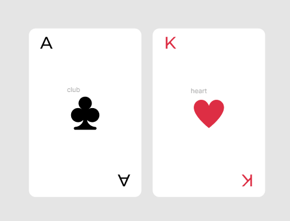

## Getting Started

First, run the development server:

```bash
pnpm run dev
```

Open [http://localhost:3000](http://localhost:3000) with your browser to see the result.

You can start editing the page by modifying `pages/index.js`. The page auto-updates as you edit the file.

## Learn More

To learn more about Next.js, take a look at the following resources:
- [React Documentation](https://reactjs.org/docs/getting-started.html) - learn about React features and API.
- [Next.js Documentation](https://nextjs.org/docs) - learn about Next.js features and API.
- [Learn Next.js](https://nextjs.org/learn/foundations/about-nextjs) - an interactive Next.js tutorial.
- [Tailwind CSS](https://tailwindcss.com/docs) - learn about Tailwind CSS features and API.
- [Zustand](https://github.com/pmndrs/zustand) - learn about Zustand features and API.

You can check out [the Next.js GitHub repository](https://github.com/vercel/next.js/) - your feedback and contributions
are welcome!

## Project setup skill test

1. Integration project with Turbo repo
2. Setup project with Next.js or Create React App
3. Setup project with Tailwind CSS

## UI Component skill test
1. Create a card component with Tailwind CSS
2. State management
3. Correctly display the card component with the correct value and suit





## Figma Design
- [Preview](https://www.figma.com/file/6pqpZWG5Ki6Y850VHoQRHF/Wireframing-in-Figma?type=design&node-id=0-1&t=Y86J1e76KJEUw5Yu-0)