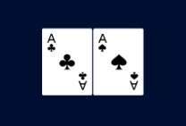

## Getting Started

First, run the development server:

```bash
yarn dev
```

Open [http://localhost:3000](http://localhost:3000) with your browser to see the result.

You can start editing the page by modifying `pages/index.js`. The page auto-updates as you edit the file.

## Learn More

To learn more about Next.js, take a look at the following resources:

- [Next.js Documentation](https://nextjs.org/docs) - learn about Next.js features and API.
- [Learn Next.js](https://nextjs.org/learn/foundations/about-nextjs) - an interactive Next.js tutorial.

You can check out [the Next.js GitHub repository](https://github.com/vercel/next.js/) - your feedback and contributions
are welcome!

## Skill Test

1. Create components and pages for rendering Card and List
2. Create a context for managing the state of the application
   - You can use pure React Context or use Redux, Recoil, or any other state management library
3. Create a custom hook for managing the state of the application
   - Hook must be able to manage the state of the application
4. Show the list of cards
   - Create a page for showing the list of cards
   - Create a component for showing the list of cards
   - Create a component for showing the card
   - Create a component for showing the deck
   - Create a component for manage the list of cards (draw, pullback to top deck, shuffle card in deck)
   - List must be filterable by card name (eg: "A" will show all cards that have "A" in their name)
5. Draw the card into list
   - Card must be unique on the list
   - Card must have rank and suit (eg: 2S, 3H, 4D, 5C, 6S, 7H, 8D, 9C, 10S, JS, QH, KD, AC)
   - Deck must be display correctly card remaining
   - The card on top of the deck must be the card that was drawn
   - State must be saved on local storage
6. Pullback the card into deck
   - Card must be unique on the deck
   - The card selected must be removed from the list and added to the top of the deck
   - Deck must be display correctly card remaining
   - State must be saved on local storage
7. Shuffle the card in deck
   - The card in the deck must be shuffled
   - Deck must be display correctly card remaining
   - State must be saved on local storage
8. Responsive design
   - Mobile screen list of cards must be in a single column
   - Desktop screen list of cards must be in a 4 column layout
   - Large screen list of cards must be in a 6 column layout
9. Unit test state management

## Example Card Rendering
AC = Ace of Club (♣)

AS = Ace of Spade (♠)


